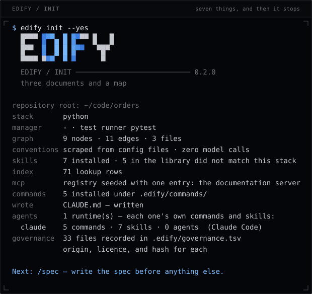
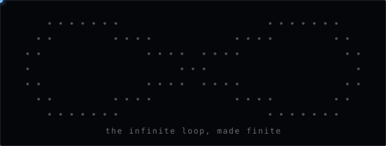

<div align="center">


# EDIFY

**Three documents and a map. Think hard once, then build without thinking.**

[Install](#install) · [The five commands](#the-five-commands-you-type) · [Runtimes](#edify-init-new--a-folder-from-zero-for-whichever-agent-you-open) · [Docs](docs/) · [Website](https://edify-agents.github.io/EDIFY/)

</div>

EDIFY is a harness that sits around an AI coding agent and makes it work reliably on
large, real codebases — the kind with a million lines, fifteen years of history, four
languages, and nobody left who remembers why the payments module is like that.

It is not a model, not an agent framework, and not a wrapper around a chat interface.

---

## The problem it closes

A frontier model with a plain setup writes excellent code and still fails on serious
projects. Not from lack of intelligence — from four structural gaps that no model
generation closes:

- **It cannot see a codebase it cannot fit in its context.** Every session starts blind
  and re-derives the same map, expensively and slightly differently each time.
- **It fragments across sessions.** The same work done in parts, in different ways,
  never as one whole.
- **It builds what was asked instead of what was meant.** An ambiguous brief produces a
  confident, well-built, wrong thing.
- **It writes against the library it remembers instead of the one installed.**

EDIFY closes exactly those four and gets out of the way of everything else.

## Install

macOS, Linux, and Windows, from the same artifact. Python 3.10 or newer is the whole
requirement — there are no dependencies, no compiler, and no runtime to install on a
build server.

```bash
pipx install edify-agents-cli           # or: uv tool install edify-agents-cli
brew install edify-dev/tap/edify        # macOS, if you prefer brew

cd your-repository
edify init

edify init new ./service                # or: a folder from zero, for every agent
```

Per-platform detail, PATH fixes, and where EDIFY keeps its own files are in
[INSTALL.md](INSTALL.md).

<p align="center">
  
</p>

`init` does seven things and then stops: detect the stack, extract the graph, scrape
the conventions from your config files, install the skill entries your stack matches,
seed the server registry, write a fifteen-line `CLAUDE.md`, and record every file it
put there. No interview, no constitution, no governance level to choose.



It asks exactly one question — which library entries to install, because those become
trusted instruction in every matching session and you should see the list first. With
no terminal it asks nothing and installs the matched set, so CI, a pipe, and a model
calling the binary all behave as they did before the question existed.

```bash
edify init --yes                        # the whole matched set, no question
edify init --skills planner,verifier    # exactly these
edify init --skills none                # none; add them later with `edify skills add`
```

Starting in a folder rather than joining a repository, use `setup` instead. `init` finds
its root by walking upward, so a new folder inside an existing checkout installs into the
parent; `setup` pins the root where you point it, creates the folder if it is missing,
and installs everything. `--fresh` clears EDIFY's own files first and leaves everything
else — including a skill or command you wrote by hand — exactly where it was.

```bash
edify setup ./service --yes             # a new folder, everything installed, root pinned
edify setup . --fresh --yes             # reinstall the harness over this repository
```

### `edify init new` — a folder from zero, for whichever agent you open

`init` and `setup` write `CLAUDE.md` and `.claude/`. That install is invisible to the
five other tools your team has open. `edify init new` sets a folder up from nothing for
every agent runtime EDIFY knows: the root is pinned where you point it, EDIFY's own
files are cleared first, every library entry is installed, and the same block is written
into every instruction file each runtime actually reads.

| runtime | reads | commands land in |
|---|---|---|
| Claude Code | `CLAUDE.md` | `.claude/commands/`, `.claude/skills/`, `.claude/agents/` |
| OpenAI Codex | `AGENTS.md` | `.codex/prompts/` |
| Cursor | `AGENTS.md`, `.cursor/rules/edify.mdc` | `.cursor/commands/` |
| Gemini CLI | `GEMINI.md` | `.gemini/commands/` (TOML) |
| GitHub Copilot | `.github/copilot-instructions.md` | `.github/prompts/` |
| Windsurf | `.windsurf/rules/edify.md` | `.windsurf/workflows/` |
| anything else | `AGENTS.md` | — |

<table>
  <tr>
    <td></td>
    <td></td>
    <td></td>
  </tr>
  <tr>
    <td></td>
    <td></td>
    <td></td>
  </tr>
</table>

And it asks first. Detection reads your `pyproject.toml`; it cannot read that this is a
rewrite of something already in production or that nothing may touch migrations without
a plan. Eight short questions, before anything is written, because two of them decide
what gets installed — which runtimes, and what detection missed. The answers go to
`.edify/profile.md`, which every instruction file points at, and which is yours to edit.
Press enter to skip any of them.

```bash
edify init new ./service                       # ask, then install for every runtime
edify init new . --agents claude,cursor        # only these two
edify init new . --yes                         # ask nothing, install everything
edify init new . --no-interview --keep         # reinstall, keep the profile as it is
```

With no terminal — CI, a pipe, a model calling the binary — nothing is asked, no profile
is written, and the full install happens anyway. A question is never load-bearing.

A later `edify init` keeps every runtime already set up in the folder current, rather
than updating `CLAUDE.md` and leaving the other five stale.

It runs offline. Nothing here opens a socket except `edify upgrade`, which also has a
plain-archive path for air-gapped networks.

## The five commands you type

| command | what it does | model | ends at |
|---|---|---|---|
| `/spec` | a brief becomes a specification | strongest | a human |
| `/plan` | spec → technology decisions and milestones | strongest | a human |
| `/tasks` | spec + plan + graph → a phased task list | strongest | a human |
| `/build` | task list → working software | cheapest that follows instructions | a diff and a green suite |
| `/verify` | the code → evidence | strong, and never a session that wrote code | a report anyone can read |

The first three are slow and expensive and end at a human. The fourth is fast and cheap
and ends at working software. `/verify` can be re-run by anyone at any time.

<table>
  <tr>
    <td width="50%"></td>
    <td width="50%"></td>
  </tr>
  <tr>
    <td align="center"><sub><code>/spec</code> · <code>/plan</code> · <code>/tasks</code> — three reads, one after another</sub></td>
    <td align="center"><sub><code>/build</code> — red to green</sub></td>
  </tr>
</table>

They are installed to `.edify/commands/` with thin pointers under each runtime's own
command directory — `.claude/commands/`, `.codex/prompts/`, `.cursor/commands/`,
`.gemini/commands/`, `.github/prompts/`, `.windsurf/workflows/` — so `/spec` resolves in
whichever tool you are typing into while the methodology stays in one canonical place. The skill library is mirrored the same way — `.claude/skills/<name>/SKILL.md`
per entry, carrying the description the runtime matches on and pointing at
`.edify/skills/<name>.md` — so an installed entry is discoverable in the session you are
typing into and still exists in exactly one place. `edify skills sync` rewrites the
mirror if you add or remove an entry by hand.

## The binary

<p align="center">
  
</p>

`edify` installs the harness, builds and queries the graph, resolves skills, and checks
formats. It is a pure function over files: every command reads files and writes files,
and none holds state or opens a socket while doing your work. (`edify upgrade` pulls a
skill library and has an archive path for an air-gapped machine; `edify self update`
replaces the binary and hands the fetching to uv, pipx, or pip, with `--offline` to
refuse. Those two, and nothing else.)

```bash
edify graph build                     # full extraction
edify graph where isExpired           # → src/auth/clock.ts:12  symbol  isExpired
edify graph dependents createSession  # everything that breaks if it changes
edify graph defines src/api/router.ts # what this file exports
edify graph overlap "a.ts b.ts" "c.ts"# can these two tasks run at once
edify graph references generate       # who calls or imports this

edify init new ./service              # a folder from zero, for every agent, asks first
edify check [--fix] [--exit-code]     # report what is wrong with the documents
edify skills resolve implementer 4    # the one file a spawn loads
edify mcp for implementer 4           # what servers that spawn would load
edify governance list                 # every file edify installed, and where it came from
edify governance verify               # is it still what was installed
edify doctor                          # does the install work here
edify feedback                        # four questions, written to a file on this machine

edify self where                      # which edify is this, and where did it come from
edify self update [--from PATH]       # put an edited checkout behind the `edify` binary
edify license status                  # plan, entitlements, and limits
```

Nothing blocks. `edify check` prints; a person or a CI job decides what that means. If
you need a hard block, that is `edify check --exit-code` or `/verify` in your own CI,
owned by you — and we say so rather than implying we ship one.

## What lands in your repository

```
CLAUDE.md              # ~15 lines: what this repo is, the commands, where the graph is
AGENTS.md              # the same block, for every runtime that reads this file
GEMINI.md              # …and one per runtime — `init new` writes them all
.edify/
  graph/               # nodes.tsv, edges.tsv, meta — mechanical, regenerable
  skills/              # the subset your stack matched, plus index.tsv
  commands/            # the five command files
  formats/             # the three format contracts and their worked examples
  mcp.md               # the server registry: pinned, scoped per role and phase
  conventions.md       # scraped from lint/format/tsconfig/CI — no model call
  profile.md           # what you answered when `init new` asked — yours to edit
  governance.tsv       # every file above: origin, provenance, licence, hash
specs/
  <feature>/
    spec.md            # what is being built and why
    plan.md            # when the feature needs one
    tasks.md           # exactly what changes, where, in what order
    verification.md    # written by /verify
```

`.edify/graph/` is regenerable and may be committed or ignored by taste. Everything else
is source.

## Governance you can read

A control counts as governance if a person can look at it and tell whether the work
complied: advisory means advisory, and a record means a readable record. So every file
EDIFY installs is recorded in `.edify/governance.tsv` — what it is, where it came
from, under what licence, and its hash at the moment it landed.

```bash
edify governance list      # 26 files · 11 shipped · 7 library · 1 scraped · 1 seeded …
edify governance verify    # modified  .edify/skills/planner.md  changed since it was installed
edify governance rebuild   # re-baseline after a deliberate change
```

`verify` separates a file EDIFY owns being changed — `upgrade` will overwrite it —
from a file your repository owns being maintained, which is what `.edify/mcp.md` and
`.edify/conventions.md` are for. It prints; `--exit-code` is how you turn it into a
gate you own. The graph is deliberately not in the ledger: it is regenerated output
and carries its own checksums.

## The graph

A mechanically extracted map: every file, module, exported symbol, route and table, with
the edges between them, as sorted checksummed text. A rebuild over unchanged source is
byte-identical, so a graph diff is a structural diff of the codebase.

**It is never written by a model** — not at install, not as a fallback, not for a
language the extractor does not cover. Where a language is not covered the graph has no
nodes for it and `meta.languages_uncovered` says which. A missing symbol is a visible
gap; an invented one is a guess wearing the costume of a fact.

Python is parsed with a real syntax tree. Everything else is covered by a declarative
line scanner, and `meta.method_<language>` records which, so a scan is never mistaken for
a parse. For parse-grade precision across the rest, install Universal Ctags and run
`edify graph build --extractor ctags`. The TSV contract is the asset; the extractor is
replaceable by construction.

## Verification comes first

Phase 2 of every build turns each assertion in the spec into an executable test that
**fails**, before any core logic exists. Everything after that is making red go green.

That is what makes a cheap builder safe: it is not judging whether its work is correct,
it is hitting a target that already exists, and progress is a number anyone can watch
instead of a claim anyone has to trust.

## Editions

<p align="center">
  
</p>

**The public edition is the whole product.** `edify-agents-cli` is MIT-licensed, free,
and needs no account: every command, every query, every check, the whole methodology
tree, on a repository of any size, in as many repositories as you like. It has no caps
except one — the MCP registry scopes a single server into spawns.

**The team edition is by licence.** `edify-agents-teams` adds the team commands, and a
team or partner licence lifts the one-server rule. `partner` plans are free for
University of Toronto design teams and researchers.

There is no payment and no price anywhere. A licence is issued on request.

```bash
edify license status                   # which edition this machine runs, and what a licence adds
edify license activate <token>         # the token you were sent
```

The licence is a signed token verified locally with no phone-home. The source is
readable and the check is local: a licence is a contract, not a technical protection
measure, and we would rather say that than break offline operation pretending otherwise.

## Feedback, and the absence of telemetry

**There is no telemetry. Not anonymous, not aggregate, not opt-out.** Nothing in this
tool reports what you ran, what repository you ran it in, or that you installed it.
The buyer here is frequently the person who has to explain to somebody external what
touched the source tree, and a tool that phones home loses that conversation.

So feedback works the other way round:

```bash
edify feedback              # four questions → a file under your config directory
edify feedback list         # what you have written; none of it has been sent
edify feedback off          # the one-line invitation never appears again
```

The file stays on your machine. `edify feedback` prints a `gh issue create` command
and a URL, and sending it is something you do, having read it. The invitation itself
is one dim line on stderr, shown at most once per released version, only on a real
terminal, and never inside CI or a pipe.

## What EDIFY does not do

It does not wrap the agent runtime, host a model, or route between providers. It does not
run a server, a daemon, or a database. It does not enforce anything at runtime. It does
not attempt to make a weak model competent — it makes a competent model efficient, and
the difference is the whole product.

It is also not for a solo developer on a small project. A frontier model in auto mode is
already excellent there. The value starts where the codebase stops fitting in the context
window.

## Development

```bash
git clone https://github.com/EDIFY-agents/EDIFY && cd EDIFY
pip install -e ".[dev]"
pytest
```

The design reasoning behind these choices — the principles every decision here satisfies
and the buildable blueprint — is kept in the private repository. The test suite checks that this repository satisfies what it asks of yours —
every skill file valid and under budget, every command file short, and the worked
examples parsing against the formats they calibrate.

## Licence

See [LICENSE](LICENSE). Skill files carry their own provenance and licence in
frontmatter; entries marked `provenance: adapted` are governed by their upstream licence.
